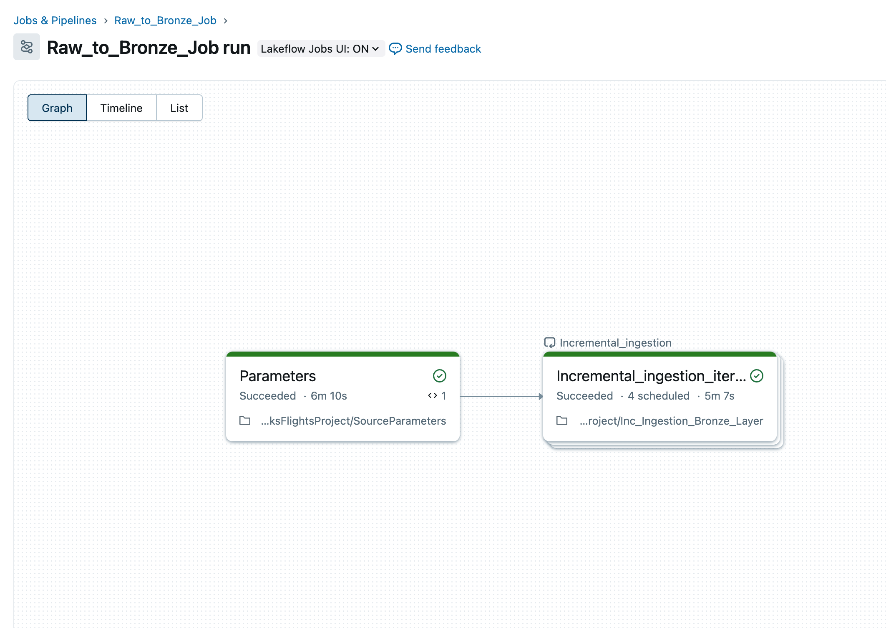
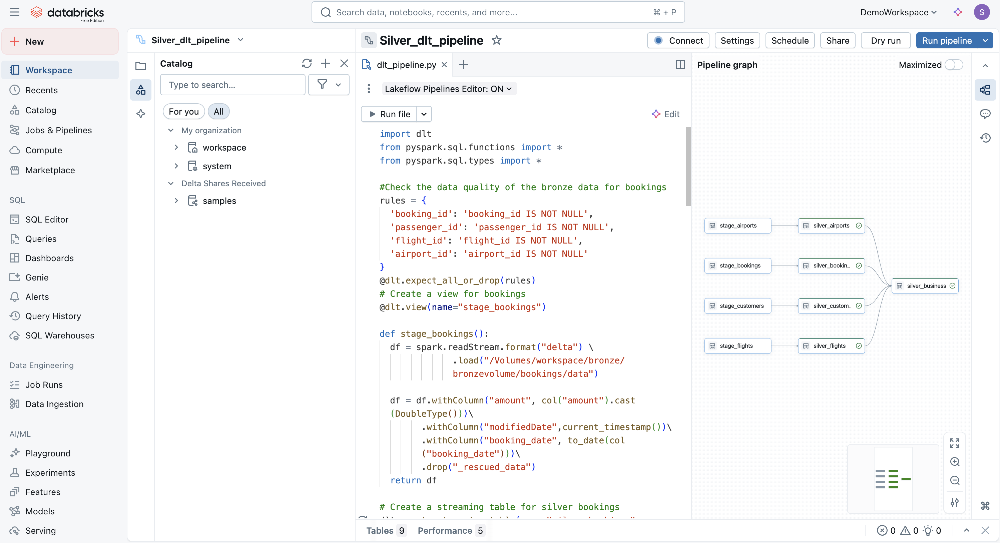
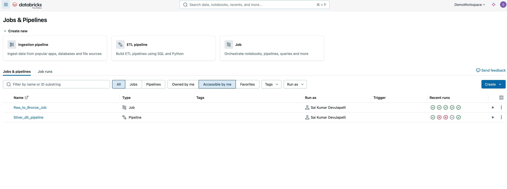

## Databricks Flights Lakehouse — End‑to‑End Pipeline (Raw → Bronze → Silver → Gold)

This repo contains an end‑to‑end Databricks Lakehouse pipeline that ingests raw CSVs into Unity Catalog Volumes, lands them in Bronze via incremental Structured Streaming (Auto Loader), transforms to Silver using ETL + Delta Live Tables (DLT), and builds Gold dimensional models (dim_airports, dim_flights, dim_customers, fact_bookings) with SCD Type 1 and CDC semantics.

### Prerequisites

- Databricks workspace with Unity Catalog enabled.

- A cluster or SQL warehouse for notebooks, a DLT entitlement for pipeline runs.

- Storage credentials configured for UC Volumes (workspace‑managed recommended).

- CSV source files available locally for upload to the Raw Volume.

### Creating Required Directories and Volumes:


```sql
CREATE SCHEMA if not exists workspace.rawflightsdata
CREATE VOLUME if not exists workspace.rawflightsdata.rawvolume

-- Creating the Bronze, silver and Gold volumes once the schemas are created 
CREATE SCHEMA if not exists workspace.bronze;
CREATE SCHEMA if not exists workspace.silver;
CREATE SCHEMA if not exists workspace.gold;

-- Creating the Bronze, silver and Gold volumes once the schemas are created 
CREATE VOLUME if not exists workspace.bronze.bronzevolume;
CREATE VOLUME if not exists workspace.silver.silvervolume;
CREATE VOLUME if not exists workspace.gold.goldvolume;
```

### Derived paths (Unity Catalog Volumes): for example

Raw Volume root: /Volumes/catalog/raw_flights/raw_volume

Checkpoints Bronze Volume : /Volumes/workspace/bronze/bronzevolume/airports/checkpoint

Data Bronze Volume : /Volumes/catalog/bronze_schema/bronze_volume/airports/data

### Bronze ingestion (Auto Loader job)

Notebook: bronze_ingest_autoloader

Incremental ingest from the Raw Volume → Bronze Delta using Auto Loader (cloudFiles).

```python

df = spark.readStream.format("cloudFiles") \
          .option("cloudFiles.format", "csv") \
          .option("cloudFiles.schemaLocation", f"/Volumes/workspace/bronze/bronzevolume/{source_value}/checkpoint")\
          .option("cloudFiles.schemaEvolutionMode", "rescue") \
          .load(f"/Volumes/workspace/rawflightsdata/rawvolume/rawdata/{source_value}/")

df.writeStream.format("delta") \
            .trigger(once=True) \
            .outputMode("append")\
            .option("checkpointLocation", f"/Volumes/workspace/bronze/bronzevolume/{source_value}/checkpoint") \
            .option("path", f"/Volumes/workspace/bronze/bronzevolume/{source_value}/data") \
            .start()

```

Repeat similarly for airports_raw, customers_raw, and bookings_raw using the Job workflow (jobs/bronze_ingest_job)


### Silver ETL (DLT pipeline):
File: DLT_Silver_Pipeline/dlt_bronze_to_silver_pipeline.py (Python DLT)



### Jobs & Pipelines:


### Gold models (notebooks)

Notebook: notebooks/gold_dimensions

Create Gold dimensions and fact with identity surrogate keys and Type 1 semantics.

#### SCD Type 1 & CDC
##### Type 1 (latest‑wins) pattern

All dimensions use MERGE with business keys (airport_id, passenger_id, flight_id) and create, update in place semantics.

CDC options: 
1. Auto Loader (used here for CSV):

Bronze is append‑only; Silver enforces keys + latest record using dropDuplicates or windowing on an ModifiedDate column.

2. Delta Change Data Feed (CDF) (if sources update Bronze) using the Job run manually or trigger automatically.

##### Some Quality and Observability:
- DLT expectations gate bad data (expect, expect_or_drop, expect_all_or_fail).
- Checkpoints stored in UC Volume checkpoints per stream.
and more.


#### Complete Workflow:
- Run setup: creates catalog/schemas/volumes.
- Upload CSVs to Raw Volume under folder names flights/, airports/, customers/, bookings/.
- Run Bronze Job: execute bronze_ingest_autoloader via Workflows (availableNow or scheduled).
- Run Silver DLT: deploy DLT_Silver_Pipeline/dlt_bronze_to_silver_pipeline.py, start a pipeline run; verify expectations.
- Build Gold: run gold_dimensions and gold_fact notebooks to merge into dims/fact.
- Validate: sample queries below.
    ```sql
    select * from workspace.gold.dimcustomers
    select * from workspace.gold.fact_bookings
    select count(*) as count, DimAirportsKey from workspace.gold.dimairports group by DimAirportsKey having count(*) > 1;
    ```

Thank You !!